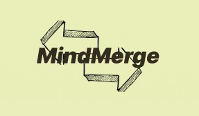

# MindMerge

MindMerge is a web-based platform designed to facilitate skill exchange and increase community-driven learning in local and global range. This platform provides a dedicated space for users to create profiles highlighting their skills and what they want to learn. It removes financial and geographical barriers, creating a vibrant ecosystem of collaboration, mutual learning and networking.

# Use Case
John, a marketing professional seeking to broaden his skill set, discovers MindMerge, a platform facilitating skill exchange. He connects with Sarah, a proficient graphic designer, and initiates regular online sessions in exchange for assisting her with social media marketing. With confidence in Sarah's expertise verified through certifications and videos on her profile, John actively participates in community events and skill showcases, enhancing his learning experience. Impressed by Sarah's teachings, John provides her with a glowing 5-star rating. Through consistent feedback and engagement, John not only improves his graphic design skills but also expands his professional network, demonstrating the platform's efficacy in increasing collaborative learning and skill development.

# Features
- **Skill Exchange:** Connect with users who possess the skills you want to learn, and offer your own expertise in return.
- **Skill Showcase Sessions:** Participate in periodic skill showcase sessions to explore new interests and connect with potential skill exchange partners.
- **Quality Assurance:** Verify the expertise of potential partners through certifications and relevant videos uploaded to their profiles.
- **Community Engagement:** Engage in forums, discussions, and community events related to your interests and skills.
- **Advanced Matching:** Utilize advanced matching algorithms to find suitable skill exchange partners based on preferences, location, and availability.
- **Efficient Scheduling:** Schedule skill exchange sessions conveniently through the platform, whether for offline meetups or online lectures.
- **Teaching Skills Enhancement:** Access resources and tools to enhance your teaching skills and get feedback, rating from users to become a better educator.
- **Optional Payments:** Make optional payments via the platform's easy payment gateway for added convenience.

# Getting Started
To get started with MindMerge, simply follow these steps:

- **Sign Up:** Create an account on MindMerge by visiting www.mindmerge.com
- **Create Your Profile:** Complete your profile by providing information about the skills you possess and wish to learn, along with your location for geographic matching.
- **Explore Skills:** Browse through the platform to discover skills you want to learn or teach.
- **Initiate Skill Exchange:** Initiate skill exchange sessions with potential partners based on mutual interests and availability.
- **Attend Showcase Sessions:** Attend periodic skill showcase sessions to explore new interests and connect with potential partners.
- **Provide Feedback:** After each skill exchange session, provide ratings and feedback on the teaching quality to help maintain a high standard of instruction.

# Tech stack
### The following are the tech stacks required to be installed if you want to run this code on your machine

- HTML, CSS, JavaScript
- NodeJS, ExpressJS, Mongodb, Mongoose
